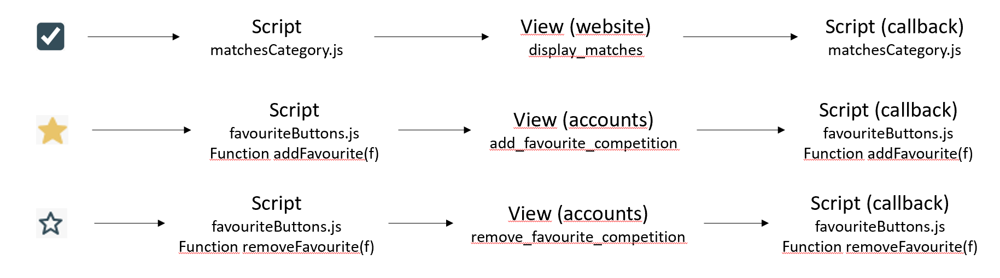

# Sports Data for Nerds project

The purpose of this project is to create an online community for rugby enthusiasts to share thoughts and comments on upcoming, ongoing and past games for mutual benefit and entertainment. It will contain content that is currently available only by visiting a number of different sites.

I'm writing this ReadMe to present a few important points about the project.

# Table of Contents
1. [Display a competition added to scraping routines](#display-a-competition-added-to-scraping-routines)
2. [URL](#url)
3. [Checkoxes operation for fixtures and forum parts](#checkoxes-operation-for-fixtures-and-forum-parts)
4. [Prediction part in a match page](#prediction-part-in-a-match-page)
5. [Standings part in a match page](#standings-part-in-a-match-page)
6. [Conclusion](#conclusion)

## Display a competition added to scraping routines

You need to add the scraped competition to the database to be able to display it in the fixture and forum parts.

To do this, simply go to Django admin and follow the steps below:

There's no need to fill in the slug fields, they'll be filled in automatically when you create the new competition. However, if you want to modify the “Thread league” and/or “Thread category” fields of a one competition, you'll also need to modify the slug fields accordingly.

## URL

Sometimes you will see variables present in the views that are not used in the processing. They're there just to make the URL make more sense.

URL: 

View:

Here, during the processing in the view, we don’t use the fact that the thread is in the international category.

## Checkoxes operation for fixtures and forum parts

In both sections, the checkboxes are managed by the dropDownMenu.js script, in particular the following function _initializeDropDownMenu_. It allows only one checkbox to be selected at a time, attaches the right colour to the competitions in relation to the colour of their category (International, club, etc.) and rotates the small arrow when the category is scrolled.

Here we're going to talk about ajax requests for these two parts.

- AJAX requests for the section 'Fixtures':

- AJAX requests for the section 'Forum':

Eventually, you'll have to merge the two JS for the favourite part. They're exactly the same functions, but with differences to make them work in each case. I haven't been able to do it due to lack of time.

Important: Here, competitions appear when a check box is selected only if the name of the competition in the table __'matches'__ corresponds the name of the competition in the __'threads_categories_match table'__.

## Prediction part in a match page

This part is present in the match page. It can only be accessed if you have an account. The first prediction opens one week before the match and closes three days before the match. The second prediction opens 3 days before the match and closes one hour before.
I put a sort of grey veil when the elements were inaccessible. It is possible to override this. So, for security reasons I've disabled the validate buttons that allow you to create or complete the prediction table if there is this veil.

- AJAX requests for the prediction part in a match page:

## Standings part in a match page

Here, we consider two cases: where the ranking contains pools and where the ranking contains no pools. When there are pools, a slider appears to scroll through the different pools. For the final phases, matches are put in the draw subcategory.

- AJAX requests for the standings part in a match page:

## Conclusion 

- The sportData repository folder contains the blank database. You'll need to make a backup when testing, especially if you're adding/modifying tables, so you can go back easily.
- The sportDataDeployment folder contains the version of the project uploaded to the server. The setting file is modified accordingly.
- All credentials for the project are in the credentials file
- Use a frontend framework such as react or svelt in addition to the django backend framework
